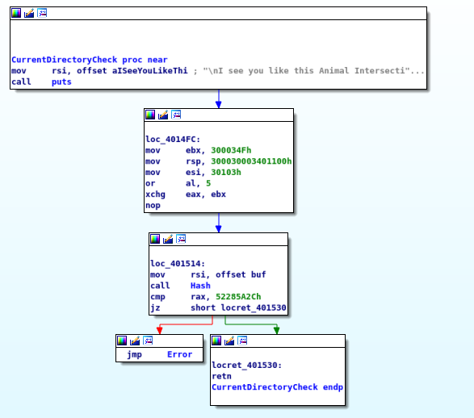

# CrackMe Lab
One of the projects in our Computer Architecture and Assembly Languages course was to design a CrackMe program and exchange it with our groupmates. Here is my solution to [@apselon](https://github.com/apselon)'s work. You could check his sources as well as his solution to the program I devised [at his repository](https://github.com/apselon/Vzlom).

## Toolchain
I am going to mostly use freeware version of [Hex Rays IDA Pro](https://www.hex-rays.com/products/ida/). In order to edit hex files I am using [hexcurse](https://github.com/LonnyGomes/hexcurse).
[Z3Py](https://www.cs.tau.ac.il/~msagiv/courses/asv/z3py/guide-examples.htm), a Python interface for [Z3 Theorem Prover](https://github.com/Z3Prover/z3) would be useful for cracking non-cryptographic hash functions.

## First look
*Note that I have already inserted function names into the program according to what they do. They were not originally present.*

First of all, let's take a look at the `start` function of the program:


There are several checks and a message in the end. Let's dive into this!

## Dealing with anti-debugging
Let's have a look at the first function


As we can see, it calls `sys_ptrace` and starts tracing on itself. Though **this is not an issue per se**, it might prohibit using debugger. This can be fixed with a simple patch and does not require our attention.

## Buffer overflow vulnerability
Let's have a look at the next function:


It saves address of code that prints error message and closes the program into a variable, reads user's input into small buffer and jumps to the address in the variable. Let's have a look at memory near this buffer:


The variable is located just after the buffer! Thus we could design an input that will overflow the buffer and carefully modify the jump address.
However, in this case we can jump to the very end of program using such string of bytes: `61 61 73 14 40 00`. However, for the sake of education and reading funky messages from my groupmate, we will instead use `61 61 C3 14 40 00` that will allow us to exit the function.

## Wait, why the hell program modifies itself?
The next function is just a loop that modifies some part of the program:


We will see the purpose of this ordeal just in a moment...

## What is going on?!
The next function looks rather strange to me:



Turns out that the previous one should decode this one! With the power of patching we can see how it should look:


Actually this function gets current working directory and checks its hash sum. It is not valid, the program halts. Let's have a look at hash function:


It seems to be quite an easy one. One way to break it is to use **SMT Solver** (you could read about SMT on [Wikipedia](https://en.wikipedia.org/wiki/Satisfiability_modulo_theories)). I will use Z3Py, since it is quite easy to work with. We can implement this hash function with a simple code snippet:

```Python
def SimpleHashBitVec(key):
    old_len = len(key)
    key.append(BitVecVal(0xA, 32))
    key.append(BitVecVal(0, 32))
    key.append(BitVecVal(0, 32))
    key.append(BitVecVal(0, 32))

    hs = 0
    for i in range(old_len + 1):
        hs += key[i]
        hs += key[i+1] << 8
        hs += key[i+2] << 16
        hs += key[i+3] << 24
        hs *= BitVecVal(4, 32)
        hs = ~hs
    hs *= BitVecVal(4, 32)
    return simplify(hs)
```
After that it is easy to crack the function. 
After finding suitable dir name I proceeded to the next check.

## One more hash
Next function reads the string and checks its hash value:


We can deal with this check in similar manner.
`61 61 C3 14 40 00 34 40 46 22 3C 2B 52 3F 57 70 0A` will do for the whole program.

## Epilogue
After dealing with the final check, we can see the final message. After this the program will halt. Here is the final result:

 

However, I have also made simple patcher that operates in terminal. And it has a Hackercat! This is what the interface looks like (it displays username as your name):


After patching program works with any input and from any directory:


### Thank you for your attention!